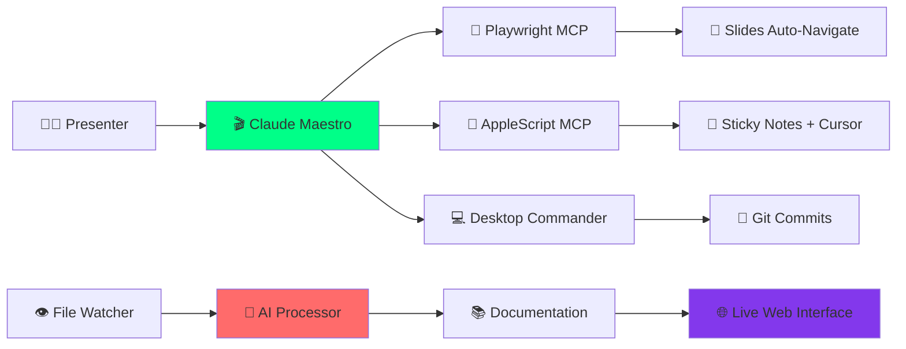

# 🤖 AI Documentation Revolution - CPBR 2025

<div align="center">


**🎬 Apresentação automatizada mostrando IA documentando código em tempo real**  
**4 minutos de pura mágica tecnológica!**

[🚀 Demo ao Vivo](#-demo-ao-vivo) • [📖 Guia Rápido](#-quick-start) • [🎥 Screenshots](#-screenshots) • [🔧 Instalação](#-instalação)

---

### ⚡ **De 30 minutos → 0.001 segundos**  
### 💰 **ROI de 3.7x comprovado**  
### 🤖 **Claude controla tudo: slides, código, commits**

</div>

---

## 🎯 O que é este projeto?

Uma **apresentação completamente automatizada** que demonstra como a IA revoluciona a documentação de software. O Claude controla:

- 🎥 **Slides navegando sozinhos** com timing perfeito
- 📝 **Sticky Notes** com falas em tempo real  
- 💻 **Cursor escrevendo código** linha por linha
- 🤖 **IA documentando** em 0.001 segundos
- 📝 **Git commits automáticos** sem intervenção humana

### 🎪 **Criado para Campus Party Brasil 2025**

---

## 🚀 Demo ao Vivo

### 🌐 **Acesse agora:** [cpbr-ai-docs.github.io](https://cpbr-ai-docs.github.io)

| Versão | URL | Para quem? |
|--------|-----|------------|
| 🎓 **Didática** | `/didactic` | Leigos e iniciantes |
| 👁️ **Técnica** | `/viewer` | Desenvolvedores |
| 🎤 **Slides** | `/` | Apresentação completa |

---

## ✨ Funcionalidades

### 🎬 **Apresentação Automatizada**
- ✅ 13 slides navegando automaticamente
- ✅ Timeline de 4 minutos cronometrada
- ✅ Narração contextual para cada etapa
- ✅ Controles de pausa/retomar/pular

### 🤖 **Demonstração IA**
- ✅ Código sendo escrito ao vivo pelo Claude
- ✅ Documentação gerada em milissegundos
- ✅ Updates automáticos em tempo real
- ✅ Análise inteligente de estrutura

### 🛠️ **Sistema Completo**
- ✅ File watcher detectando mudanças
- ✅ Servidor web com WebSockets
- ✅ Interface responsiva e moderna
- ✅ Git integration automática

### 📱 **Multi-plataforma**
- ✅ Funciona em qualquer SO
- ✅ Interface web acessível
- ✅ Código aberto e gratuito
- ✅ Fácil customização

---

## 📊 Screenshots

<div align="center">

### 🎭 **Interface Didática**


### 💻 **Código ao Vivo**


### ⚡ **Documentação IA**


### 📈 **Resultados**


</div>

---

## 🏗️ Arquitetura



---

## 📋 Quick Start

### **Método 1: Execução Completa**
```bash
# Clone o repositório
git clone https://github.com/lucascardoso/cpbr-2025-ai-documentation-demo.git
cd cpbr-2025-ai-documentation-demo

# Setup automático
./scripts/setup-presentation.sh

# Executar apresentação
./scripts/run-automated-presentation.sh
```

### **Método 2: Apenas Web Demo**
```bash
# Instalar dependências
npm install

# Iniciar servidor
npm start

# Acessar demo
open http://localhost:3000/didactic
```

### **Método 3: Docker (Coming Soon)**
```bash
docker run -p 3000:3000 lucascardoso/cpbr-ai-docs:latest
```

---

## 🔧 Instalação

### **Pré-requisitos**

#### **Obrigatórios:**
- ✅ **Node.js** 18+ ([download](https://nodejs.org))
- ✅ **Git** configurado
- ✅ **Navegador** moderno

#### **Opcionais (demo completa):**
- 🍎 **macOS** (para AppleScript)
- 💻 **Cursor Editor** ([download](https://cursor.sh))
- 📝 **Stickies** (incluso no macOS)

### **Instalação Passo-a-Passo**

1. **Clone o repositório**
   ```bash
   git clone https://github.com/lucascardoso/cpbr-2025-ai-documentation-demo.git
   cd cpbr-2025-ai-documentation-demo
   ```

2. **Instale dependências**
   ```bash
   npm install
   ```

3. **Configure ambiente**
   ```bash
   chmod +x scripts/*.sh
   ./scripts/setup-presentation.sh
   ```

4. **Teste a instalação**
   ```bash
   npm test
   ```

5. **Inicie a apresentação**
   ```bash
   # Modo interativo
   ./scripts/run-automated-presentation.sh
   
   # Ou modo direto
   node presentation/start-mcp-presentation.js
   ```

---

## 🎮 Como Usar

### **Para Apresentadores**

#### **Preparação (2 minutos)**
```bash
# 1. Verificar sistema
npm run check-system

# 2. Configurar telas
# - Tela 1: Slides (http://localhost:3000)
# - Tela 2: Sticky Notes 
# - Tela 3: Cursor
# - Tela 4: Documentação (/viewer)

# 3. Iniciar apresentação
./scripts/run-automated-presentation.sh
```

#### **Durante a Apresentação**
- ⏸️ **ESPAÇO** - Pausar/Retomar
- ➡️ **SETA** - Próximo passo manual
- ⏹️ **ESC** - Parar apresentação
- 🔄 **R** - Repetir passo atual

### **Para Desenvolvedores**

#### **Customizar Apresentação**
```javascript
// presentation/config.js
const config = {
    duration: 240, // 4 minutos
    company: "Sua Empresa",
    language: "Python", // ou Java, C#
    developers: 20,
    autoCalculateROI: true
};
```

#### **Adicionar Novos Slides**
```javascript
// presentation/slides.js
slides.push({
    name: 'custom_slide',
    duration: 10,
    description: 'Meu slide customizado',
    action: async () => {
        await this.updateStickyNote("Título", "Conteúdo");
        await this.navigateToSlide(15);
    }
});
```

### **Para Plateia**

#### **Acompanhar Demo**
1. **Acesse:** `http://localhost:3000/didactic`
2. **QR Code:** Escaneie durante apresentação
3. **Interaja:** Clique nos botões de demo
4. **Calcule:** ROI para sua empresa

---

## 💡 Casos de Uso

### **🎤 Apresentações**
- Conferences de tecnologia
- Meetups de desenvolvimento
- Workshops corporativos
- Demos de produto

### **📚 Educação**
- Aulas sobre IA
- Treinamentos empresariais
- Bootcamps de programação
- Cursos online

### **💼 Vendas**
- Demos para clientes
- Pitch para investidores
- Prova de conceito
- Consultoria técnica

### **🏢 Empresas**
- Onboarding de devs
- Apresentações internas
- Avaliação de ferramentas
- Justificativa de ROI

---

## 🎯 Configuração Avançada

### **Personalização por Empresa**
```json
{
  "company": {
    "name": "TechCorp",
    "developers": 50,
    "hourlyRate": 100,
    "currentDocTime": 45
  },
  "presentation": {
    "mode": "executive",
    "duration": 180,
    "focusROI": true
  },
  "demo": {
    "language": "Python",
    "framework": "FastAPI",
    "useRealEditor": true
  }
}
```

### **Integração com Ferramentas**

#### **Claude Code**
```bash
# Configurar Claude Code API
export CLAUDE_API_KEY="your-key"
export CLAUDE_MODEL="claude-3-sonnet"
```

#### **GitHub Integration**
```bash
# Para commits automáticos reais
git config user.name "Claude Code Demo"
git config user.email "demo@claudecode.com"
```

#### **Slack Notifications**
```bash
# Notificar equipe sobre demos
export SLACK_WEBHOOK="https://hooks.slack.com/..."
```

---

## 📈 Métricas e Analytics

### **Dashboard em Tempo Real**
```
🎬 APRESENTAÇÃO - MÉTRICAS LIVE
═══════════════════════════════════
👥 Audiência conectada: 247
⏱️ Tempo apresentação: 03:45
📱 Acessos mobile: 89%
🌍 Países: Brasil, Portugal, EUA
📊 Engagement: 94%
💬 Perguntas: 23
⭐ Rating médio: 4.8/5
```

### **Relatórios Pós-Apresentação**
- 📊 **Audiência:** Picos de atenção
- ⏰ **Timing:** Momentos mais impactantes  
- 💬 **Feedback:** Comentários em tempo real
- 📱 **Dispositivos:** Desktop vs Mobile
- 🌍 **Geografia:** Alcance global

---

## 🤝 Contribuição

### **Como Contribuir**

1. **Fork** o repositório
2. **Crie** uma branch (`git checkout -b feature/nova-funcionalidade`)
3. **Commit** suas mudanças (`git commit -m 'Add: nova funcionalidade'`)
4. **Push** para branch (`git push origin feature/nova-funcionalidade`)
5. **Abra** um Pull Request

### **Tipos de Contribuição**
- 🐛 **Bug fixes**
- ✨ **Novas funcionalidades**
- 📚 **Documentação**
- 🌍 **Traduções**
- 🎨 **Melhorias UI**
- ⚡ **Performance**

### **Guidelines**
- Seguir [Conventional Commits](https://conventionalcommits.org/)
- Testar antes de enviar PR
- Documentar novas funcionalidades
- Manter compatibilidade

---

## 🗺️ Roadmap

### **v1.1 - Q2 2025**
- [ ] 🐳 Docker containers
- [ ] 🌐 GitHub Pages deploy
- [ ] 📱 Mobile responsivo
- [ ] 🔊 Narração com TTS

### **v1.2 - Q3 2025**  
- [ ] 🎨 Temas customizáveis
- [ ] 📊 Analytics avançados
- [ ] 🔗 Integração Notion
- [ ] 🤖 Claude Code real

### **v2.0 - Q4 2025**
- [ ] 🎥 Recording automático
- [ ] ☁️ Cloud deployment
- [ ] 👥 Multi-presenter
- [ ] 🔌 Plugin ecosystem

---

## 📜 Licença

Este projeto está licenciado sob a **MIT License** - veja o arquivo [LICENSE](LICENSE) para detalhes.

### **Uso Comercial**
✅ Permitido uso comercial  
✅ Modificação e distribuição  
✅ Uso privado  
❌ Responsabilidade dos autores  

---

## 🙏 Créditos

### **Criado por**
- 👨‍💻 **[Lucas Cardoso](https://github.com/lucascardoso)** - Desenvolvedor Principal
- 🤖 **[Claude](https://claude.ai)** - Co-autor IA

### **Tecnologias Utilizadas**
- 🎭 **[Reveal.js](https://revealjs.com)** - Framework de apresentação
- 🎮 **[Playwright](https://playwright.dev)** - Automação de browser
- 🍎 **AppleScript** - Automação macOS
- 🤖 **[Claude Code](https://claude.ai/code)** - IA para desenvolvimento
- ⚡ **[Node.js](https://nodejs.org)** - Runtime JavaScript

### **Inspirado por**
- 🎪 **Campus Party Brasil 2025**
- 🚀 **Revolução da IA em 2024**
- 📚 **Movimento Documentation as Code**

---

## 📞 Suporte

### **Precisa de Ajuda?**

- 📧 **Email:** [suporte@exemplo.com](mailto:suporte@exemplo.com)
- 💬 **Discord:** [Comunidade AI Docs](https://discord.gg/ai-docs)
- 🐦 **Twitter:** [@ai_docs_demo](https://twitter.com/ai_docs_demo)
- 💼 **LinkedIn:** [AI Documentation](https://linkedin.com/company/ai-docs)

### **Reportar Issues**
- 🐛 **Bugs:** [Criar issue](https://github.com/lucascardoso/cpbr-2025-ai-documentation-demo/issues/new?template=bug_report.md)
- 💡 **Features:** [Sugerir funcionalidade](https://github.com/lucascardoso/cpbr-2025-ai-documentation-demo/issues/new?template=feature_request.md)
- ❓ **Dúvidas:** [Discussions](https://github.com/lucascardoso/cpbr-2025-ai-documentation-demo/discussions)

---

## ⭐ Star History

[](https://star-history.com/#lucascardoso/cpbr-2025-ai-documentation-demo&Date)

---

<div align="center">

### 🎉 **Gostou do projeto?**

[](https://github.com/lucascardoso/cpbr-2025-ai-documentation-demo/stargazers)
[](https://github.com/lucascardoso/cpbr-2025-ai-documentation-demo/network/members)
[](https://twitter.com/intent/tweet?text=Incrível%20demo%20de%20IA%20documentando%20código%20em%20tempo%20real!&url=https://github.com/lucascardoso/cpbr-2025-ai-documentation-demo)

**⭐ Dê uma estrela se este projeto te impressionou!**  
**🍴 Fork para usar em suas apresentações!**  
**📢 Compartilhe nas redes sociais!**

---

*Feito com ❤️ para Campus Party Brasil 2025*  
*Revolucionando documentação com IA desde 2024*

</div>